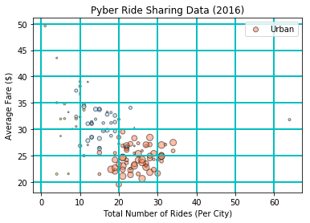
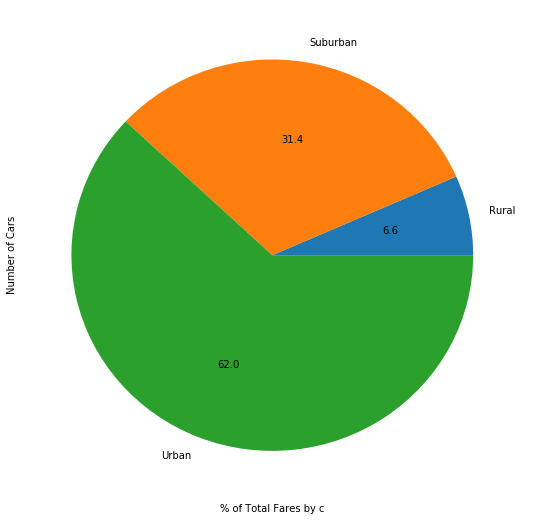
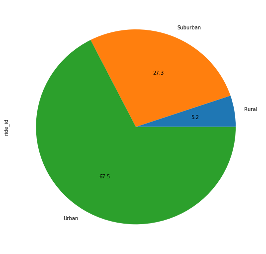
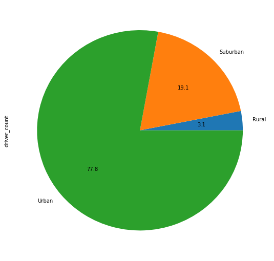

### Analysis
#### - Urban areas have a higher ride volume the suburban and rural areas but the avg fare is much lower.
#### - Urban areas had more rides, drivers and fares than suburban and rural areas. Hypothesis is that this is due to higher demand from larger populations. Suggest doing a correlation analysis with population to confirm.
#### - Urban areas had a large variance in number of drivers. Suggest further analysis on urban cities with lower than average driver count to determine if additional drivers would increase ride volume and/or average fare.


```python
import matplotlib.pyplot as plt
import pandas as pd
import numpy as np
import os
import seaborn as sns

```


```python
# read in files and create df
ride_data = os.path.join("raw_data", "ride_data.csv")
city_data = os.path.join("raw_data", "city_data.csv")

ride_data_df = pd.read_csv(ride_data)
city_data_df = pd.read_csv(city_data)
```


```python
city_index_df = city_data_df.set_index('city')
#city_index_df
```


```python
# Merge the two datasets on "City" 
combined_data_df = pd.merge(ride_data_df, city_data_df, on='city', how='inner')
combined_final = pd.DataFrame(combined_data_df)
combined_final.head()
```


<div>
<style scoped>
    .dataframe tbody tr th:only-of-type {
        vertical-align: middle;
    }

    .dataframe tbody tr th {
        vertical-align: top;
    }

    .dataframe thead th {
        text-align: right;
    }
</style>
<table border="1" class="dataframe">
  <thead>
    <tr style="text-align: right;">
      <th></th>
      <th>city</th>
      <th>date</th>
      <th>fare</th>
      <th>ride_id</th>
      <th>driver_count</th>
      <th>type</th>
    </tr>
  </thead>
  <tbody>
    <tr>
      <th>0</th>
      <td>Sarabury</td>
      <td>2016-01-16 13:49:27</td>
      <td>38.35</td>
      <td>5403689035038</td>
      <td>46</td>
      <td>Urban</td>
    </tr>
    <tr>
      <th>1</th>
      <td>Sarabury</td>
      <td>2016-07-23 07:42:44</td>
      <td>21.76</td>
      <td>7546681945283</td>
      <td>46</td>
      <td>Urban</td>
    </tr>
    <tr>
      <th>2</th>
      <td>Sarabury</td>
      <td>2016-04-02 04:32:25</td>
      <td>38.03</td>
      <td>4932495851866</td>
      <td>46</td>
      <td>Urban</td>
    </tr>
    <tr>
      <th>3</th>
      <td>Sarabury</td>
      <td>2016-06-23 05:03:41</td>
      <td>26.82</td>
      <td>6711035373406</td>
      <td>46</td>
      <td>Urban</td>
    </tr>
    <tr>
      <th>4</th>
      <td>Sarabury</td>
      <td>2016-09-30 12:48:34</td>
      <td>30.30</td>
      <td>6388737278232</td>
      <td>46</td>
      <td>Urban</td>
    </tr>
  </tbody>
</table>
</div>


```python
def type_int(type_val):
    if type_val=='Urban':
        return 1
    elif type_val=="Suburban":
        return 2
    else:
        return 3

combined_data_df['type_int'] = combined_data_df['type'].apply(type_int)
#combined_data_df
```


```python
ride_data = combined_data_df.set_index('ride_id')
ride_data.head()
```


<div>
<style scoped>
    .dataframe tbody tr th:only-of-type {
        vertical-align: middle;
    }

    .dataframe tbody tr th {
        vertical-align: top;
    }

    .dataframe thead th {
        text-align: right;
    }
</style>
<table border="1" class="dataframe">
  <thead>
    <tr style="text-align: right;">
      <th></th>
      <th>city</th>
      <th>date</th>
      <th>fare</th>
      <th>driver_count</th>
      <th>type</th>
      <th>type_int</th>
    </tr>
    <tr>
      <th>ride_id</th>
      <th></th>
      <th></th>
      <th></th>
      <th></th>
      <th></th>
      <th></th>
    </tr>
  </thead>
  <tbody>
    <tr>
      <th>5403689035038</th>
      <td>Sarabury</td>
      <td>2016-01-16 13:49:27</td>
      <td>38.35</td>
      <td>46</td>
      <td>Urban</td>
      <td>1</td>
    </tr>
    <tr>
      <th>7546681945283</th>
      <td>Sarabury</td>
      <td>2016-07-23 07:42:44</td>
      <td>21.76</td>
      <td>46</td>
      <td>Urban</td>
      <td>1</td>
    </tr>
    <tr>
      <th>4932495851866</th>
      <td>Sarabury</td>
      <td>2016-04-02 04:32:25</td>
      <td>38.03</td>
      <td>46</td>
      <td>Urban</td>
      <td>1</td>
    </tr>
    <tr>
      <th>6711035373406</th>
      <td>Sarabury</td>
      <td>2016-06-23 05:03:41</td>
      <td>26.82</td>
      <td>46</td>
      <td>Urban</td>
      <td>1</td>
    </tr>
    <tr>
      <th>6388737278232</th>
      <td>Sarabury</td>
      <td>2016-09-30 12:48:34</td>
      <td>30.30</td>
      <td>46</td>
      <td>Urban</td>
      <td>1</td>
    </tr>
  </tbody>
</table>
</div>


```python
def type_str(type_n):
    if type_n==1:
        return 'Urban'
    elif type_n==2:
        return 'Suburban'
    else:
        return 'Rural'

city_groups_df = pd.DataFrame(ride_data.groupby(['city'])['fare'].mean())
city_groups_df['Total Rides'] = ride_data.groupby(['city'])['fare'].count()
city_groups_df['Total Drivers'] = ride_data.groupby(['city'])['driver_count'].mean()
city_groups_df['City Type Int'] = ride_data.groupby(['city'])['type_int'].mean()
city_groups_df['City Type'] = city_groups_df['City Type Int'].apply(type_str)


city_groups_df = city_groups_df.rename(columns={"fare":"Avg Fare"})
city_groups_df = city_groups_df.round(2)
city_groups_df.head()
```


<div>
<style scoped>
    .dataframe tbody tr th:only-of-type {
        vertical-align: middle;
    }

    .dataframe tbody tr th {
        vertical-align: top;
    }

    .dataframe thead th {
        text-align: right;
    }
</style>
<table border="1" class="dataframe">
  <thead>
    <tr style="text-align: right;">
      <th></th>
      <th>Avg Fare</th>
      <th>Total Rides</th>
      <th>Total Drivers</th>
      <th>City Type Int</th>
      <th>City Type</th>
    </tr>
    <tr>
      <th>city</th>
      <th></th>
      <th></th>
      <th></th>
      <th></th>
      <th></th>
    </tr>
  </thead>
  <tbody>
    <tr>
      <th>Alvarezhaven</th>
      <td>23.93</td>
      <td>31</td>
      <td>21</td>
      <td>1</td>
      <td>Urban</td>
    </tr>
    <tr>
      <th>Alyssaberg</th>
      <td>20.61</td>
      <td>26</td>
      <td>67</td>
      <td>1</td>
      <td>Urban</td>
    </tr>
    <tr>
      <th>Anitamouth</th>
      <td>37.32</td>
      <td>9</td>
      <td>16</td>
      <td>2</td>
      <td>Suburban</td>
    </tr>
    <tr>
      <th>Antoniomouth</th>
      <td>23.62</td>
      <td>22</td>
      <td>21</td>
      <td>1</td>
      <td>Urban</td>
    </tr>
    <tr>
      <th>Aprilchester</th>
      <td>21.98</td>
      <td>19</td>
      <td>49</td>
      <td>1</td>
      <td>Urban</td>
    </tr>
  </tbody>
</table>
</div>


```python
def type_color(type_c):
    if type_c==1:
        return '#ff7f50'
    elif type_c==2:
        return '#87CEFA'
    else:
        return '#ffd700'
    
city_groups_df['City Color'] = city_groups_df['City Type Int'].apply(type_color)

city_groups_df.head(20)
```


<div>
<style scoped>
    .dataframe tbody tr th:only-of-type {
        vertical-align: middle;
    }

    .dataframe tbody tr th {
        vertical-align: top;
    }

    .dataframe thead th {
        text-align: right;
    }
</style>
<table border="1" class="dataframe">
  <thead>
    <tr style="text-align: right;">
      <th></th>
      <th>Avg Fare</th>
      <th>Total Rides</th>
      <th>Total Drivers</th>
      <th>City Type Int</th>
      <th>City Type</th>
      <th>City Color</th>
    </tr>
    <tr>
      <th>city</th>
      <th></th>
      <th></th>
      <th></th>
      <th></th>
      <th></th>
      <th></th>
    </tr>
  </thead>
  <tbody>
    <tr>
      <th>Alvarezhaven</th>
      <td>23.93</td>
      <td>31</td>
      <td>21</td>
      <td>1</td>
      <td>Urban</td>
      <td>#ff7f50</td>
    </tr>
    <tr>
      <th>Alyssaberg</th>
      <td>20.61</td>
      <td>26</td>
      <td>67</td>
      <td>1</td>
      <td>Urban</td>
      <td>#ff7f50</td>
    </tr>
    <tr>
      <th>Anitamouth</th>
      <td>37.32</td>
      <td>9</td>
      <td>16</td>
      <td>2</td>
      <td>Suburban</td>
      <td>#87CEFA</td>
    </tr>
    <tr>
      <th>Antoniomouth</th>
      <td>23.62</td>
      <td>22</td>
      <td>21</td>
      <td>1</td>
      <td>Urban</td>
      <td>#ff7f50</td>
    </tr>
    <tr>
      <th>Aprilchester</th>
      <td>21.98</td>
      <td>19</td>
      <td>49</td>
      <td>1</td>
      <td>Urban</td>
      <td>#ff7f50</td>
    </tr>
    <tr>
      <th>Arnoldview</th>
      <td>25.11</td>
      <td>31</td>
      <td>41</td>
      <td>1</td>
      <td>Urban</td>
      <td>#ff7f50</td>
    </tr>
    <tr>
      <th>Campbellport</th>
      <td>33.71</td>
      <td>15</td>
      <td>26</td>
      <td>2</td>
      <td>Suburban</td>
      <td>#87CEFA</td>
    </tr>
    <tr>
      <th>Carrollbury</th>
      <td>36.61</td>
      <td>10</td>
      <td>4</td>
      <td>2</td>
      <td>Suburban</td>
      <td>#87CEFA</td>
    </tr>
    <tr>
      <th>Carrollfort</th>
      <td>25.40</td>
      <td>29</td>
      <td>55</td>
      <td>1</td>
      <td>Urban</td>
      <td>#ff7f50</td>
    </tr>
    <tr>
      <th>Clarkstad</th>
      <td>31.05</td>
      <td>12</td>
      <td>21</td>
      <td>2</td>
      <td>Suburban</td>
      <td>#87CEFA</td>
    </tr>
    <tr>
      <th>Conwaymouth</th>
      <td>34.59</td>
      <td>11</td>
      <td>18</td>
      <td>2</td>
      <td>Suburban</td>
      <td>#87CEFA</td>
    </tr>
    <tr>
      <th>Davidtown</th>
      <td>22.98</td>
      <td>21</td>
      <td>73</td>
      <td>1</td>
      <td>Urban</td>
      <td>#ff7f50</td>
    </tr>
    <tr>
      <th>Davistown</th>
      <td>21.50</td>
      <td>25</td>
      <td>25</td>
      <td>1</td>
      <td>Urban</td>
      <td>#ff7f50</td>
    </tr>
    <tr>
      <th>East Cherylfurt</th>
      <td>31.42</td>
      <td>13</td>
      <td>9</td>
      <td>2</td>
      <td>Suburban</td>
      <td>#87CEFA</td>
    </tr>
    <tr>
      <th>East Douglas</th>
      <td>26.17</td>
      <td>22</td>
      <td>12</td>
      <td>1</td>
      <td>Urban</td>
      <td>#ff7f50</td>
    </tr>
    <tr>
      <th>East Erin</th>
      <td>24.48</td>
      <td>28</td>
      <td>43</td>
      <td>1</td>
      <td>Urban</td>
      <td>#ff7f50</td>
    </tr>
    <tr>
      <th>East Jenniferchester</th>
      <td>32.60</td>
      <td>19</td>
      <td>22</td>
      <td>2</td>
      <td>Suburban</td>
      <td>#87CEFA</td>
    </tr>
    <tr>
      <th>East Leslie</th>
      <td>33.66</td>
      <td>11</td>
      <td>9</td>
      <td>3</td>
      <td>Rural</td>
      <td>#ffd700</td>
    </tr>
    <tr>
      <th>East Stephen</th>
      <td>39.05</td>
      <td>10</td>
      <td>6</td>
      <td>3</td>
      <td>Rural</td>
      <td>#ffd700</td>
    </tr>
    <tr>
      <th>East Troybury</th>
      <td>33.24</td>
      <td>7</td>
      <td>3</td>
      <td>3</td>
      <td>Rural</td>
      <td>#ffd700</td>
    </tr>
  </tbody>
</table>
</div>


average_fare = combined_data_df.groupby(['city'])['fare'].mean()
total_rides = combined_data_df.groupby(['city'])['fare'].count()
total_drivers = combined_data_df.groupby(['city'])['driver_count'].mean()
city_type = combined_data_df.groupby(['city'])['type']

summary_table = pd.DataFrame({"Avg Fare":average_fare,
                                 "Total Rides":total_rides,
                                 "Total Drivers":total_drivers,
                                 "City Type":city_type})
summary_table.head()


```python
x_values = city_groups_df['Total Rides']
y_values = city_groups_df['Avg Fare']
z_values = city_groups_df['Total Drivers']
palette = city_groups_df['City Color']
legend = city_groups_df['City Type']

#colors = {"Light Coral":"#9b59b6", "Light Sky Blue":"#3498db", "Gold":"#95a5a6"}
```

## Bubble Plot of Ride Sharing Data


```python
plt.scatter(x_values, y_values, s=z_values, c=palette, edgecolors="black",alpha=0.5)
plt.title("Pyber Ride Sharing Data (2016)")
plt.xlabel("Total Number of Rides (Per City)")
plt.ylabel("Average Fare ($)")
plt.legend(legend,loc='upper right')
plt.grid(color='c', linestyle='-', linewidth=2)
plt.show()
```





## Total Fares by City Type


```python
fare_sum = pd.DataFrame(combined_final.groupby(['type'])['fare'].sum())
fare_sum_chart = fare_sum['fare'].plot(kind='pie', autopct='%.1f', figsize=(9,9))
fare_sum_chart.set_xlabel("% of Total Fares by c")
fare_sum_chart.set_ylabel("Number of Cars")
plt.show()
```





## Total Rides by City Type


```python
ride_count = pd.DataFrame(combined_final.groupby(['type'])['ride_id'].count())
ride_count_chart = ride_count['ride_id'].plot(kind='pie', autopct='%.1f', figsize=(9,9))
fare_sum_chart.set_xlabel("% of Total Rides by c")
fare_sum_chart.set_ylabel("Number of Rides")
plt.show()
```





## Total Drivers by City Type


```python
driver_counts = pd.DataFrame(city_data_df.groupby(['type'])['driver_count'].sum())
driver_count_chart = driver_counts['driver_count'].plot(kind='pie', autopct='%.1f', figsize=(9,9))
fare_sum_chart.set_xlabel("% of Total Rides by c")
fare_sum_chart.set_ylabel("Number of Rides")
plt.show()

```




